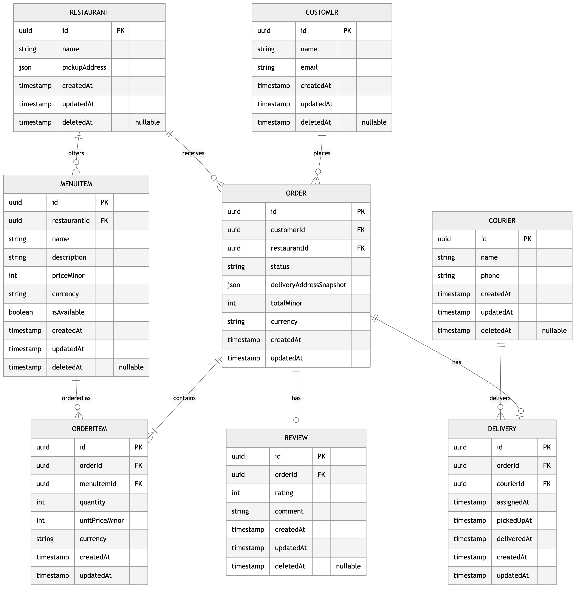
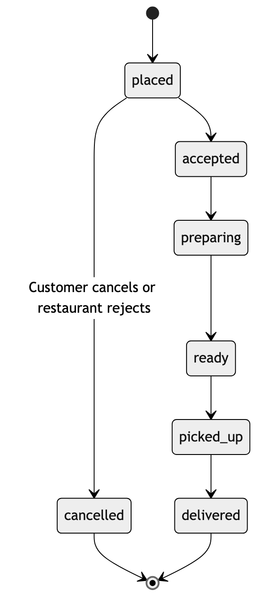
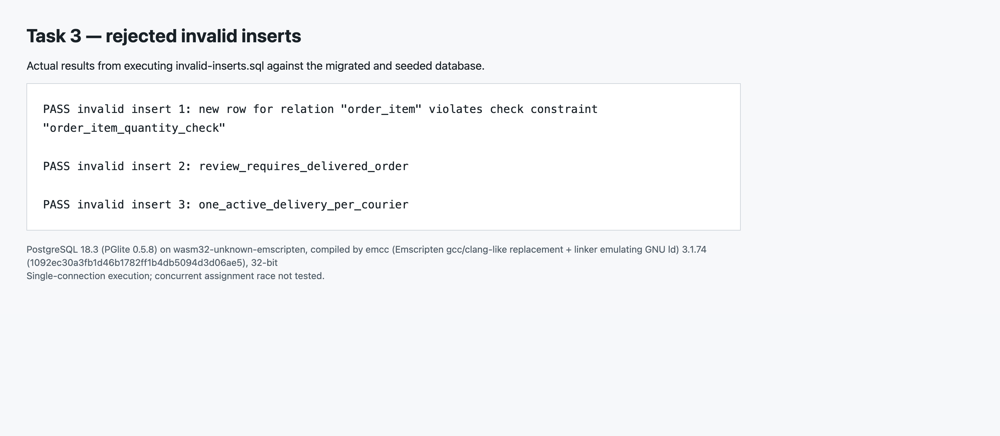

# Food Delivery Platform — Design Document (Task 3)

This is a design document with a small implemented PostgreSQL schema proof, **not** a food-delivery
application. There is no application server, payment processing, worker, GraphQL server, or live
tracking implementation. Payments, refunds, review moderation, account deletion, live GPS, a
frontend, working HTTP handlers, authentication, and external payment integrations are out of
scope; no `Payment` entity or payment-related order state exists anywhere in this design.

Steps 1–4 below are the design. Step 5 references the implemented schema proof in
[`task3-proof/`](task3-proof/), which is the only part of this repository that actually runs.

- Requirements source: [Step 1](#step-1--requirements)
- Data model and diagrams: [Step 2](#step-2--entities-and-relationships)
- Design reasoning (the "hard questions"): [Step 3](#step-3--design-reasoning)
- API contracts, REST vs GraphQL, SSE vs WebSocket: [Step 4](#step-4--api-contracts)
- Implementation proof and evidence: [Step 5](#step-5--implementation-proof-reference)

---

## Step 1 — Requirements

**Product.** Customers order food from restaurants; restaurants prepare orders; couriers collect
and deliver them.

**Roles**

| Role | Can do |
|---|---|
| Customer | Browse menus, place orders, track status, review restaurants after delivery |
| Restaurant | Manage its own menu, accept/reject its own orders, progress preparation |
| Courier | Accept delivery jobs, record pickup and delivery |

**Five main actions** (every later design decision traces back to one of these):

1. Customer places an order from a restaurant's menu.
2. Restaurant accepts/rejects the order and progresses it to ready.
3. Courier accepts the delivery and records pickup and delivery.
4. Customer receives live order-status updates without polling.
5. Customer reviews the restaurant after delivery.

**Business rules**

- An order has exactly one customer and restaurant, a delivery address, and at least one available
  menu item from that restaurant. Quantities and prices are positive. Duplicate `menuItemId`s in
  the request are rejected.
- The server obtains prices from the menu and calculates `total = sum(quantity × unit price)`. No
  fees, discounts, taxes, or client-supplied prices exist in this design.
- Order/item currencies must match. Unit price and delivery address are stored as snapshots at
  order time: later ordinary edits (e.g. a menu price change) must not change an existing order's
  agreed values.
- A restaurant can manage only its own menu and orders. Customer identity comes from
  authentication, never a request-body `customerId`. Only the assigned courier can record
  pickup/delivery for an order.
- Courier assignment is permitted for `accepted`/`preparing`/`ready` orders with no existing
  delivery. Each courier has at most one active delivery at a time. There is no reassignment
  workflow in this version.
- The customer may cancel only while `placed`; the restaurant may reject only while `placed`. Both
  produce `cancelled`. There is no refund flow.
- Only the owning customer can review a delivered order. One restaurant review per order, rating
  1–5; couriers are not rated.
- Tracking is live status only, not a GPS map.
- Historical transaction records (orders, order items, deliveries) cannot be deleted by ordinary
  application operations. Reference/catalogue rows (customers, restaurants, couriers, menu items,
  reviews) use soft deletion instead. Administrative retention/anonymisation and review moderation
  are outside this prototype.

---

## Step 2 — Entities and relationships

SQL is snake_case ([`migration.sql`](task3-proof/migration.sql) is the source of truth); the
document and API use camelCase. All entities have UUIDv4 `id`, `createdAt`, and `updatedAt`.
Nullable fields are marked explicitly — everything else is required.

| Entity | Fields | Nullable | Notes |
|---|---|---|---|
| **Customer** | `id`, `name`, `email` (unique), `createdAt`, `updatedAt`, `deletedAt` | `deletedAt` | Identity and contact |
| **Restaurant** | `id`, `name`, `pickupAddress` (json), `createdAt`, `updatedAt`, `deletedAt` | `deletedAt` | Identity and pickup address |
| **Courier** | `id`, `name`, `phone`, `createdAt`, `updatedAt`, `deletedAt` | `deletedAt` | Identity and contact |
| **MenuItem** | `id`, `restaurantId` (FK), `name`, `description`, `priceMinor`, `currency`, `isAvailable`, `createdAt`, `updatedAt`, `deletedAt` | `description`, `deletedAt` | One restaurant's offered item |
| **Order** | `id`, `customerId` (FK), `restaurantId` (FK), `status`, `deliveryAddressSnapshot` (json), `totalMinor`, `currency`, `createdAt`, `updatedAt` | — | No `deletedAt`: a transaction record, retained forever by trigger |
| **OrderItem** | `id`, `orderId` (FK), `menuItemId` (FK), `quantity`, `unitPriceMinor`, `currency`, `createdAt`, `updatedAt` | — | `unitPriceMinor`/`currency` are a historical snapshot, immutable after insert |
| **Delivery** | `id`, `orderId` (FK, unique), `courierId` (FK), `assignedAt`, `pickedUpAt`, `deliveredAt`, `createdAt`, `updatedAt` | `pickedUpAt`, `deliveredAt` | No separate stored `status` — derived from `Order.status` and these timestamps |
| **Review** | `id`, `orderId` (FK, unique), `rating`, `comment`, `createdAt`, `updatedAt`, `deletedAt` | `comment`, `deletedAt` | Customer and restaurant derive through `Order` |

**Cardinalities**

- Customer 1 → 0..many Orders; Restaurant 1 → 0..many Orders / MenuItems.
- Order 1 → 1..many OrderItems; MenuItem 1 → 0..many OrderItems (Order ↔ MenuItem is many-to-many
  through OrderItem).
- Order 1 → 0..1 Delivery; Courier 1 → 0..many historical Deliveries, at most one **active** at a
  time.
- Order 1 → 0..1 Review.

**ER diagram** (generated from [`diagrams/entities.html`](task3-proof/diagrams/entities.html), the
editable Mermaid original; verified field-by-field against `migration.sql`, including nullability
and `deletedAt`):



**Order lifecycle diagram** (generated from
[`diagrams/order-lifecycle.html`](task3-proof/diagrams/order-lifecycle.html)):



---

## Step 3 — Design reasoning

### Normalisation and snapshots

Customer, restaurant, courier, and current menu facts each live in their own table — no repeated
current-state fields elsewhere. Two **deliberate** historical copies exist, made because an order
must keep the terms it was agreed under even after the source of truth changes later:

1. `OrderItem.unitPriceMinor` (+ `currency`) — copied from `MenuItem.priceMinor` at insert time. A
   later menu price change must never alter an existing order's item lines.
2. `Order.deliveryAddressSnapshot` — copied at order creation. The customer's saved address may
   change later without rewriting past orders.

`Order.totalMinor` is a third deliberate stored value: a derived sum, not a normalised fact. It is
stored (rather than computed on every read) because it is the legally/financially significant
number a customer agreed to pay, and it is checked against the live item sum by a deferred
constraint trigger (`validate_order_items()`) at commit — so it can never silently drift from its
line items. None of these three values is re-validated against today's menu price on later
order-state updates (accept/prepare/ready/etc.) — only at initial item insert.

### Money and identifiers

Monetary fields are integer minor units plus an ISO-shaped currency code:
`MenuItem.priceMinor`, `Order.totalMinor`, `OrderItem.unitPriceMinor` — all SQL `bigint`, never
floating point. `currency` is checked against `^[A-Z]{3}$`: a shape check, not a lookup against the
full ISO 4217 catalogue. All ids are UUIDv4. UUIDv4 prevents straightforward sequential
guessing/counting of resources; it does **not** replace access checks and does not make every form
of enumeration impossible (e.g. a leaked id is still a valid id).

### Lifecycle and authority

```
placed → accepted → preparing → ready → picked_up → delivered
placed → cancelled   (the only cancellation edge)
```

Initial status is always `placed`. `delivered` and `cancelled` are terminal. Every transition not
drawn above is forbidden — including skipping `picked_up` and reopening a `cancelled` order. The
owning restaurant performs `accepted`/`preparing`/`ready` or the `placed → cancelled` rejection; the
owning customer can cancel only at `placed`; the assigned courier performs `picked_up`/`delivered`.
Ownership/role checks are part of the API contract (Step 4) — this schema proof enforces the
*state machine itself* with a database trigger (`validate_order_state()`), not the actor
permissions, since there is no authentication layer here to check against. Moving to `picked_up` or
`delivered` requires an existing delivery assignment and writes the corresponding delivery
timestamp (`picked_up_at`/`delivered_at`) in the same transaction as the order update.

### Time and deletion

Every entity has `createdAt`/`updatedAt`. Customer, Restaurant, Courier, MenuItem, and Review have
nullable `deletedAt` (soft deletion). Order, OrderItem, and Delivery reject deletion outright via a
trigger (`retain_transaction()`) — they are historical transaction records, not reference data. This
is a design choice for this prototype, not a claim that such records are legally required to persist
forever; a real retention/anonymisation policy is out of scope here and would also need to consider
that `Order.deliveryAddressSnapshot` carries personal data even after a customer's own row is
soft-deleted. `MenuItem.isAvailable` is a separate, temporary "in stock right now" flag — unrelated
to soft deletion.

### Constraints and indexes

See [`migration.sql`](task3-proof/migration.sql) for the literal source; not every rule below has a
named SQL constraint object — several are trigger-raised errors instead:

| Rule | Enforced by |
|---|---|
| Primary keys, `NOT NULL`, positive quantity/price, currency shape, rating 1–5, delivery timestamp ordering | Column constraints / `CHECK` |
| One review per order, one delivery per order | `UNIQUE(order_id)` on `review`, `delivery` |
| One line item per menu item per order | `UNIQUE(order_id, menu_item_id)` on `order_item` |
| Order has ≥1 item; `totalMinor` equals the item sum | Deferred constraint trigger `validate_order_items()`, checked at commit |
| New item belongs to the order's restaurant, matches currency, item is available, price matches current menu | `validate_item()` |
| Only documented status transitions; delivery timestamps written alongside the order transition | `validate_order_state()` |
| Order/item/delivery/review reference and snapshot fields are immutable after insert | `fixed_references()` |
| One active delivery per courier; courier and order eligibility | `assign_courier()` |
| Review requires a delivered order | `validate_review()` |
| Orders/order items/deliveries cannot be hard-deleted | `retain_transaction()` |

`assign_courier()` locks the courier row, then the order row, before checking eligibility and
existing active work — so two concurrent assignment attempts for the same courier serialize on that
lock rather than racing. Documented isolation is **READ COMMITTED**. Its sequential rejection is
demonstrated in [`evidence/invalid-inserts.txt`](task3-proof/evidence/invalid-inserts.txt), and the
genuine two-connection race is now demonstrated against a real Neon server in
[Step 5](#step-5--implementation-proof-reference).

Indexes: `restaurant_orders(restaurant_id, status, created_at DESC, id)` supports the restaurant
queue; `assignable_orders(created_at, id) WHERE status IN (...)` is a partial index supporting
oldest-first courier discovery; `customer_orders(customer_id, created_at DESC, id)` supports
customer history; `courier_deliveries(courier_id)` supports the busy check;
`restaurant_menu(restaurant_id, name, id) WHERE deleted_at IS NULL` supports menu browsing.
`order_item`'s `UNIQUE(order_id, menu_item_id)` already serves order-line lookups by `order_id`, so
no separate index was added for that. No planner flags force index use — small tables may correctly
use sequential scans; [`evidence/query-plans.txt`](task3-proof/evidence/query-plans.txt) confirms
the two heaviest queries actually use `restaurant_orders` and `assignable_orders` under normal
planner settings on the seeded data. Multi-status list filters may still require a sort step even
with these indexes — not every possible `ORDER BY` is covered.

---

## Step 4 — API contracts

Design-only contracts: no HTTP server is implemented. Authentication and ownership are **assumed**
here, not implemented in the schema proof — every route below states the actor it assumes.

**Common shapes.** Success: `{"data": ...}`. Lists add `meta: {total, limit, offset, hasMore}`.
Errors: `{"error": {"code": "...", "message": "..."}}`. IDs are UUIDs; times are ISO 8601. All
examples below use realistic synthetic data, not real personal data.

**Idempotency.** Mutations accept an `Idempotency-Key` header, scoped to (actor, method, path).
Replaying the same key with the same payload returns the saved response; the same key with a
different payload returns `409`. Persisting that key→response mapping atomically is an API-layer
requirement — **no such mapping table exists in these eight tables**; it is not implemented here.

**Shared errors** (each route below selects only the codes that actually apply to it):

| Code | Meaning |
|---|---|
| 400 | Malformed request/identifier, or missing required `Idempotency-Key` |
| 401 | Unauthenticated |
| 403 | Role/ownership failure |
| 404 | Resource not found |
| 409 | Business/state/idempotency conflict |
| 422 | Field validation failure |
| 500 | Unexpected failure |
| 503 | Temporary service failure |

**Shared list rules** (apply to every list endpoint below): `limit` defaults to 20, max 100 —
oversized positive values clamp to 100 rather than erroring; `offset` defaults to 0; every sort has
a stable `id` tie-breaker; a negative `offset` or an invalid `sort`/`order` value returns `400`.
Endpoints marked *(completion decision)* had their exact filter/sort defaults chosen now, since the
brief left them unspecified.

### Main action routes

**1 — Place an order**

`POST /api/v1/orders` — actor: authenticated customer (from session, never a body field).

Request:

```json
{
  "restaurantId": "8f14e45f-ceea-4f88-b9bd-3e6a1e37f2a1",
  "items": [
    { "menuItemId": "a13e1e2b-1c1e-4a4a-9c9b-8f3e2b7a9d10", "quantity": 2 },
    { "menuItemId": "d2f1a9b3-5c6d-4e7f-8091-a2b3c4d5e6f7", "quantity": 1 }
  ],
  "deliveryAddress": { "line1": "45 Lake Street", "city": "Chicago", "postcode": "60601" }
}
```

`items` must be non-empty with no duplicate `menuItemId`. Prices are always server-computed from
the current menu; there is no `paymentMethodId` and no asynchronous payment status. Order + items
insert in one transaction.

`201 Created`, `Location: /api/v1/orders/5b1f5e0a-2b9a-4b8b-9c34-1f7a2e6d9c11`:

```json
{ "data": { "id": "5b1f5e0a-2b9a-4b8b-9c34-1f7a2e6d9c11", "status": "placed", "totalMinor": 3200, "currency": "USD" } }
```

Errors: `400` malformed body/missing idempotency header, `401`, `404` restaurant or menu item not
found, `409` idempotency replay conflict, `422` empty/duplicate items, non-positive quantity,
unavailable item, or currency mismatch.

**2 — Restaurant processes the order**

`PATCH /api/v1/orders/{orderId}` — actor: owning restaurant (accept/reject/preparing/ready) or
owning customer (cancel), per the state machine in Step 3.

Request:

```json
{ "status": "accepted" }
```

`200 OK`:

```json
{ "data": { "id": "5b1f5e0a-2b9a-4b8b-9c34-1f7a2e6d9c11", "status": "accepted", "updatedAt": "2026-09-24T10:15:00.000Z" } }
```

Errors: `401`, `403` wrong actor for this transition, `404`, `409` forbidden transition, `422`
unknown status value.

**3 — Courier accepts the delivery**

`POST /api/v1/orders/{orderId}/delivery` — actor: authenticated courier, from session; no body.

`201 Created`, `Location: /api/v1/orders/5b1f5e0a-2b9a-4b8b-9c34-1f7a2e6d9c11/delivery`:

```json
{
  "data": {
    "id": "4e5f6071-8a2b-4c3d-9e5f-6071829a3b4c",
    "orderId": "5b1f5e0a-2b9a-4b8b-9c34-1f7a2e6d9c11",
    "courierId": "9a2b3c4d-5e6f-4708-9a1b-2c3d4e5f6071",
    "assignedAt": "2026-09-24T10:20:00.000Z",
    "pickedUpAt": null,
    "deliveredAt": null
  }
}
```

Errors: `401`, `404` order not found, `409` order not assignable / courier already busy.

**3b — Courier records pickup / delivery**

`PATCH /api/v1/orders/{orderId}/delivery` — actor: the assigned courier only.

Request:

```json
{ "status": "picked_up" }
```

`200 OK`:

```json
{
  "data": {
    "id": "4e5f6071-8a2b-4c3d-9e5f-6071829a3b4c",
    "orderId": "5b1f5e0a-2b9a-4b8b-9c34-1f7a2e6d9c11",
    "courierId": "9a2b3c4d-5e6f-4708-9a1b-2c3d4e5f6071",
    "assignedAt": "2026-09-24T10:20:00.000Z",
    "pickedUpAt": "2026-09-24T10:40:00.000Z",
    "deliveredAt": null,
    "orderStatus": "picked_up"
  }
}
```

The input `status` (`picked_up`/`delivered`) selects the action but is **not** a stored
`Delivery.status` field — the authoritative order lifecycle updates alongside the delivery
timestamp, in the same transaction. Errors: `401`, `403` not the assigned courier, `404`, `409`
forbidden transition, `422` unknown status value.

**4 — Customer tracks status (poll and push)**

`GET /api/v1/orders/{orderId}/status` — actor: owning customer.

`200 OK`:

```json
{ "data": { "orderId": "5b1f5e0a-2b9a-4b8b-9c34-1f7a2e6d9c11", "status": "preparing", "updatedAt": "2026-09-24T10:30:00.000Z" } }
```

`GET /api/v1/orders/{orderId}/events` — actor: owning customer; `200 text/event-stream`. Sends the
current snapshot on connect/reconnect, then one event per committed status change; no historical
replay and no GPS. The client stops subscribing once the order reaches a terminal state.

```
event: order.status
data: {"orderId":"5b1f5e0a-2b9a-4b8b-9c34-1f7a2e6d9c11","status":"preparing","updatedAt":"2026-09-24T10:30:00.000Z"}
```

Both reads are idempotent. Errors: `401`, `403`, `404`.

**5 — Customer reviews the restaurant**

`POST /api/v1/orders/{orderId}/review` — actor: owning customer, order must be `delivered`, no
existing review.

Request:

```json
{ "rating": 5, "comment": "Great food!" }
```

`rating` is a required integer 1–5; `comment` is optional (an absent comment returns `null`, never
an empty string or omitted key).

`201 Created`, `Location: /api/v1/orders/5b1f5e0a-2b9a-4b8b-9c34-1f7a2e6d9c11/review`:

```json
{
  "data": {
    "id": "7071829a-3b4c-4d5e-8f60-71829a3b4c5d",
    "orderId": "5b1f5e0a-2b9a-4b8b-9c34-1f7a2e6d9c11",
    "rating": 5,
    "comment": "Great food!",
    "createdAt": "2026-09-24T12:00:00.000Z"
  }
}
```

Errors: `401`, `403`, `404`, `409` order not yet delivered or already reviewed, `422` bad rating.

### Supporting routes

**Menu management** — actor: owning restaurant for writes; browsing is unauthenticated.

`GET /api/v1/restaurants/{restaurantId}/menu` — filters: `available` (boolean); sort:
`name`|`priceMinor`, `order`: `asc`|`desc`; excludes soft-deleted items.

`200 OK`:

```json
{
  "data": [
    { "id": "d2f1a9b3-5c6d-4e7f-8091-a2b3c4d5e6f7", "restaurantId": "8f14e45f-ceea-4f88-b9bd-3e6a1e37f2a1", "name": "Garlic bread", "description": "Toasted, buttery, four pieces", "priceMinor": 850, "currency": "USD", "isAvailable": true, "createdAt": "2026-01-06T09:00:00.000Z", "updatedAt": "2026-01-07T11:00:00.000Z" },
    { "id": "a13e1e2b-1c1e-4a4a-9c9b-8f3e2b7a9d10", "restaurantId": "8f14e45f-ceea-4f88-b9bd-3e6a1e37f2a1", "name": "Rice bowl", "description": "Vegetables and rice", "priceMinor": 1200, "currency": "USD", "isAvailable": true, "createdAt": "2026-01-05T09:00:00.000Z", "updatedAt": "2026-01-05T09:00:00.000Z" }
  ],
  "meta": { "total": 2, "limit": 20, "offset": 0, "hasMore": false }
}
```

`POST /api/v1/restaurants/{restaurantId}/menu` — `name`, `priceMinor`, `currency` required;
`description` optional; `isAvailable` defaults `true`.

Request:

```json
{ "name": "Garlic bread", "priceMinor": 800, "currency": "USD", "description": "Toasted, buttery, four pieces" }
```

`201 Created`, `Location: /api/v1/restaurants/8f14e45f-ceea-4f88-b9bd-3e6a1e37f2a1/menu/d2f1a9b3-5c6d-4e7f-8091-a2b3c4d5e6f7`:

```json
{ "data": { "id": "d2f1a9b3-5c6d-4e7f-8091-a2b3c4d5e6f7", "restaurantId": "8f14e45f-ceea-4f88-b9bd-3e6a1e37f2a1", "name": "Garlic bread", "description": "Toasted, buttery, four pieces", "priceMinor": 800, "currency": "USD", "isAvailable": true, "createdAt": "2026-01-06T09:00:00.000Z", "updatedAt": "2026-01-06T09:00:00.000Z" } }
```

`PATCH /api/v1/restaurants/{restaurantId}/menu/{menuItemId}` — allows **only** `name`,
`description`, `priceMinor`, `currency`, `isAvailable`. Not "any field except `restaurantId`" —
`id`, `restaurantId`, and timestamps are never client-writable.

Request:

```json
{ "priceMinor": 850 }
```

`200 OK`:

```json
{ "data": { "id": "d2f1a9b3-5c6d-4e7f-8091-a2b3c4d5e6f7", "restaurantId": "8f14e45f-ceea-4f88-b9bd-3e6a1e37f2a1", "name": "Garlic bread", "description": "Toasted, buttery, four pieces", "priceMinor": 850, "currency": "USD", "isAvailable": true, "createdAt": "2026-01-06T09:00:00.000Z", "updatedAt": "2026-01-07T11:00:00.000Z" } }
```

This price change is exactly the kind of later edit Step 3 says must not reach past orders: any
`OrderItem` that already snapshotted `unitPriceMinor: 800` for this item keeps that value.

`DELETE /api/v1/restaurants/{restaurantId}/menu/{menuItemId}` — soft delete. `204 No Content`, no
body — not a sixth JSON response shape for this route.

Errors across these four: `401`, `403` not the owning restaurant, `404`, `422` field validation.

**Restaurant order queue**

`GET /api/v1/restaurants/{restaurantId}/orders` — actor: owning restaurant. Filter: `status`
(comma-separated list, e.g. `?status=placed,accepted`); sort: `createdAt`, `order`: `asc`|`desc`,
default `desc`. Lean rows, matching [`queries.sql`](task3-proof/queries.sql) action 2:

```json
{
  "data": [
    { "id": "5b1f5e0a-2b9a-4b8b-9c34-1f7a2e6d9c11", "status": "placed", "totalMinor": 3200, "currency": "USD", "createdAt": "2026-09-24T09:48:44.804Z" }
  ],
  "meta": { "total": 1, "limit": 20, "offset": 0, "hasMore": false }
}
```

Errors: `401`, `403` not the owning restaurant, `400` bad list params.

**Courier discovery**

`GET /api/v1/deliveries/available` — actor: authenticated courier. Filter: `restaurantId`
(optional, narrow to one restaurant). Sort: `createdAt`, `order`: `asc`|`desc`, default `asc`
*(completion decision: oldest-first stays the default for fairness — a courier calling this with no
params still sees the same order as before — but, like every other list here, it is now
overridable)*. Returns eligible **unassigned orders** (never fabricated `Delivery` rows):

```json
{
  "data": [
    { "id": "15e2c6a9-33db-4fc6-821d-c83a074af600", "restaurantId": "491daaec-9ca4-41a5-9164-e34ae164c9f3", "status": "accepted", "createdAt": "2026-09-24T07:09:44.804Z" }
  ],
  "meta": { "total": 29, "limit": 20, "offset": 0, "hasMore": true }
}
```

Errors: `401`, `400` bad list params.

**Additional reads** *(completion decisions — added to close gaps the brief left implicit)*

`GET /api/v1/restaurants` — restaurant discovery for browsing, unauthenticated. Filter: `q`
(case-insensitive substring match on `name`); sort: `name asc` only (a directory listing has one
natural order; every other list here exposes `order`, this one doesn't need to). Excludes
soft-deleted restaurants.

```json
{
  "data": [
    { "id": "8f14e45f-ceea-4f88-b9bd-3e6a1e37f2a1", "name": "Kitchen 5", "pickupAddress": { "line1": "12 Market Street", "city": "Chicago", "postcode": "60601" }, "createdAt": "2026-01-01T00:00:00.000Z", "updatedAt": "2026-01-01T00:00:00.000Z" }
  ],
  "meta": { "total": 1, "limit": 20, "offset": 0, "hasMore": false }
}
```

Errors: `400` bad list params.

`GET /api/v1/orders/{orderId}` — full order detail. Actor: owning customer, owning restaurant, or
the assigned courier. Nests `items[]` (always fetched with the order, per the "≥1 item" invariant)
but **not** delivery/review — those have their own reads below, to avoid null-heavy payloads on
every order fetch.

```json
{
  "data": {
    "id": "5b1f5e0a-2b9a-4b8b-9c34-1f7a2e6d9c11",
    "customerId": "3c9e1a2b-6f4d-4b8a-9e21-7a5c8d3f10a2",
    "restaurantId": "8f14e45f-ceea-4f88-b9bd-3e6a1e37f2a1",
    "status": "accepted",
    "deliveryAddressSnapshot": { "line1": "45 Lake Street", "city": "Chicago", "postcode": "60601" },
    "totalMinor": 3200,
    "currency": "USD",
    "createdAt": "2026-09-24T09:48:44.804Z",
    "updatedAt": "2026-09-24T10:15:00.000Z",
    "items": [
      { "id": "9c1b2a3d-4e5f-4071-8293-a4b5c6d7e8f9", "menuItemId": "a13e1e2b-1c1e-4a4a-9c9b-8f3e2b7a9d10", "quantity": 2, "unitPriceMinor": 1200, "currency": "USD" },
      { "id": "e4f5a6b7-8c9d-4e0f-a1b2-c3d4e5f6a7b8", "menuItemId": "d2f1a9b3-5c6d-4e7f-8091-a2b3c4d5e6f7", "quantity": 1, "unitPriceMinor": 800, "currency": "USD" }
    ]
  }
}
```

Errors: `401`, `403` not customer/restaurant/courier on this order, `404`.

`GET /api/v1/orders/{orderId}/delivery` — read the delivery (the natural target of the `Location`
header from action 3). Same actor set as order detail. Bare `Delivery` fields only — no
`orderStatus` convenience field here, unlike the PATCH response, since a plain read can just fetch
order status separately if it needs it.

```json
{
  "data": {
    "id": "4e5f6071-8a2b-4c3d-9e5f-6071829a3b4c",
    "orderId": "5b1f5e0a-2b9a-4b8b-9c34-1f7a2e6d9c11",
    "courierId": "9a2b3c4d-5e6f-4708-9a1b-2c3d4e5f6071",
    "assignedAt": "2026-09-24T10:20:00.000Z",
    "pickedUpAt": "2026-09-24T10:40:00.000Z",
    "deliveredAt": null
  }
}
```

Errors: `401`, `403`, `404` order not found or has no delivery yet.

`GET /api/v1/orders/{orderId}/review` — read a single order's review. Same actor set as order
detail.

```json
{ "data": { "id": "7071829a-3b4c-4d5e-8f60-71829a3b4c5d", "orderId": "5b1f5e0a-2b9a-4b8b-9c34-1f7a2e6d9c11", "rating": 5, "comment": "Great food!", "createdAt": "2026-09-24T12:00:00.000Z" } }
```

Errors: `401`, `403`, `404` order not found or has no review yet.

`GET /api/v1/me/orders` — the authenticated customer's own order history, using the
`customer_orders` index. Filter: `status` (comma list); sort: `createdAt`, `order`: `asc`|`desc`,
default `desc`.

```json
{
  "data": [
    { "id": "5b1f5e0a-2b9a-4b8b-9c34-1f7a2e6d9c11", "restaurantId": "8f14e45f-ceea-4f88-b9bd-3e6a1e37f2a1", "status": "accepted", "totalMinor": 3200, "currency": "USD", "createdAt": "2026-09-24T09:48:44.804Z" }
  ],
  "meta": { "total": 1, "limit": 20, "offset": 0, "hasMore": false }
}
```

Errors: `401`, `400` bad list params.

`GET /api/v1/restaurants/{restaurantId}/reviews` — public, unauthenticated: restaurant reviews are
reputation information a prospective customer needs *before* ordering, unlike writing one. Filter:
`rating` (optional, exact match 1–5); sort: `createdAt`, `order`: `asc`|`desc`, default `desc`.
Excludes soft-deleted reviews. No `orderId` in the row — that's an internal reference, not something
a public review listing needs to expose.

```json
{
  "data": [
    { "id": "7071829a-3b4c-4d5e-8f60-71829a3b4c5d", "rating": 5, "comment": "Great food!", "createdAt": "2026-09-24T12:00:00.000Z" }
  ],
  "meta": { "total": 1, "limit": 20, "offset": 0, "hasMore": false }
}
```

Errors: `400` bad list params, `404` restaurant not found.

### Supported operations audit

| Entity | Create | Read | Update | Delete |
|---|---|---|---|---|
| Customer | Out of scope (auth/onboarding) | Implicit via session/order relations only | Out of scope | Out of scope |
| Restaurant | Out of scope (onboarding) | `GET /restaurants`, nested in orders/menu | Out of scope (no profile-edit route defined) | Out of scope |
| Courier | Out of scope (onboarding) | Implicit via session/delivery relations only | Out of scope | Out of scope |
| MenuItem | `POST .../menu` | `GET .../menu` (list; no single-item route — the list already returns full records) | `PATCH .../menu/{id}` (restricted fields) | `DELETE .../menu/{id}` → soft delete, `204` |
| Order | `POST /orders` | `GET /orders/{id}`, `GET .../orders` (restaurant), `GET /me/orders`, `GET .../status`, SSE `.../events` | `PATCH /orders/{id}` (status only, restricted transitions) | **Unsupported** — `retain_transaction` trigger blocks it |
| OrderItem | Only via `POST /orders` (no standalone create) | Nested in order detail only | **Unsupported** — immutable, trigger-enforced | **Unsupported** |
| Delivery | `POST .../delivery` | `GET .../delivery`, `GET /deliveries/available` (orders, not rows) | `PATCH .../delivery` (timestamps only, via `status` input) | **Unsupported** — no reassignment/unassign workflow exists |
| Review | `POST .../review` | `GET .../review`, `GET /restaurants/{id}/reviews` | **Unsupported** — no edit-review route defined | Soft delete only, not exposed (moderation is out of scope) |

No requirement says there must be exactly five endpoints; this table intentionally does **not**
invent unrestricted CRUD for financial/operational records (Order/OrderItem/Delivery deletion,
price edits after the fact) or account onboarding systems that are explicitly out of scope.

### REST vs GraphQL

**The illustrative over-fetching problem.** Imagine the restaurant order queue above had instead
been implemented naively, eagerly nesting every relation to avoid a second round trip. The following
response is **illustrative only — it was not captured from a running API** (none exists):

```json
{
  "data": [
    {
      "id": "5b1f5e0a-2b9a-4b8b-9c34-1f7a2e6d9c11",
      "status": "placed",
      "totalMinor": 3200,
      "currency": "USD",
      "createdAt": "2026-09-24T09:48:44.804Z",
      "restaurant": { "id": "8f14e45f-ceea-4f88-b9bd-3e6a1e37f2a1", "name": "Kitchen 5", "pickupAddress": { "line1": "12 Market Street", "city": "Chicago", "postcode": "60601" }, "createdAt": "2026-01-01T00:00:00.000Z", "updatedAt": "2026-01-01T00:00:00.000Z" },
      "items": [
        {
          "id": "9c1b2a3d-4e5f-4071-8293-a4b5c6d7e8f9", "quantity": 2, "unitPriceMinor": 1200, "currency": "USD",
          "menuItem": { "id": "a13e1e2b-1c1e-4a4a-9c9b-8f3e2b7a9d10", "restaurantId": "8f14e45f-ceea-4f88-b9bd-3e6a1e37f2a1", "name": "Rice bowl", "description": "Vegetables and rice", "priceMinor": 1200, "currency": "USD", "isAvailable": true, "createdAt": "2026-01-05T09:00:00.000Z", "updatedAt": "2026-01-05T09:00:00.000Z" }
        },
        {
          "id": "e4f5a6b7-8c9d-4e0f-a1b2-c3d4e5f6a7b8", "quantity": 1, "unitPriceMinor": 800, "currency": "USD",
          "menuItem": { "id": "d2f1a9b3-5c6d-4e7f-8091-a2b3c4d5e6f7", "restaurantId": "8f14e45f-ceea-4f88-b9bd-3e6a1e37f2a1", "name": "Garlic bread", "description": "Toasted, buttery, four pieces", "priceMinor": 850, "currency": "USD", "isAvailable": true, "createdAt": "2026-01-06T09:00:00.000Z", "updatedAt": "2026-01-07T11:00:00.000Z" }
        }
      ],
      "delivery": null,
      "review": null
    }
  ],
  "meta": { "total": 1, "limit": 20, "offset": 0, "hasMore": false }
}
```

The restaurant object (already known — it's in the URL), the full `menuItem` object
(`description`/`isAvailable` a queue view never needs), and `delivery`/`review` nulls repeat on
**every** row, and that weight compounds with queue size. Notice item 2's `unitPriceMinor` (800, the
historical snapshot from when it was ordered) already disagrees with its nested `menuItem.priceMinor`
(850, today's price, after the menu edit shown above) — one more reason naively nesting the *current*
menu item on a historical order is actively misleading, not just heavy. Our actual documented route
above returns exactly `{id, status, totalMinor, currency, createdAt}` per order — the same facts a
GraphQL query would ask for, achieved through deliberate endpoint design rather than a query
language.

**The GraphQL alternative.** Same client need — a restaurant ops dashboard's live queue — wants
exactly those five fields, nothing nested:

```graphql
query RestaurantQueue($restaurantId: ID!, $status: [OrderStatus!], $limit: Int, $offset: Int) {
  restaurant(id: $restaurantId) {
    orders(status: $status, limit: $limit, offset: $offset) {
      total
      items { id status totalMinor currency createdAt }
    }
  }
}
```

Hypothetical matching response — no GraphQL server exists in this repository:

```json
{
  "data": {
    "restaurant": {
      "orders": {
        "total": 1,
        "items": [
          { "id": "5b1f5e0a-2b9a-4b8b-9c34-1f7a2e6d9c11", "status": "placed", "totalMinor": 3200, "currency": "USD", "createdAt": "2026-09-24T09:48:44.804Z" }
        ]
      }
    }
  }
}
```

**Verdict: REST for this fixed MVP.** A lean list plus a detail read (`GET /orders/{id}`, which
does nest `items[]`) or an optional `?expand=items` covers the payload needs shown above — REST is
not forced into an all-or-nothing choice between one giant response and N round trips. GraphQL would
earn its cost when *multiple, materially different clients* (e.g. a courier app, a restaurant
dashboard, and a customer-facing app) need meaningfully different nested shapes from the same
underlying graph; raw user count alone is not that threshold. GraphQL also does not automatically
remove server-side complexity: someone still writes resolvers, still enforces the same
ownership/role checks per field or type, and still has to bound query cost (depth/complexity
limits) to avoid a client requesting an expensive nested fan-out — the classic resolver N+1 problem
this schema's `restaurant_orders`/`assignable_orders` indexes were built to avoid at the REST layer
would need the equivalent (batching/dataloader-style resolvers) at the GraphQL layer instead.

### SSE vs WebSocket

Order-status tracking (action 4) is a single logical need: the server tells the client when status
changes; the client never talks back over that same channel (user actions like cancelling remain
ordinary HTTP requests). Server-Sent Events fits this one-way push exactly: it runs over plain
HTTP/1.1, so it passes through standard proxies/load balancers without special upgrade handling,
`EventSource` reconnects automatically on the client, and the server stays a simple "append an event
when a transaction commits" responder. WebSocket would only earn its extra complexity (bidirectional
framing, its own reconnect/backpressure handling) if the product needed low-latency client→server
traffic over the *same* channel — e.g. a live GPS map with continuous courier position updates —
which is explicitly out of scope here (tracking is status-only, not a map).

---

## Step 5 — Implementation proof (reference)

The schema proof lives in [`task3-proof/`](task3-proof/) — see
[`task3-proof/README.md`](task3-proof/README.md) for how to run it. Summary of recorded evidence
(PostgreSQL 18.3 / PGlite 0.5.8, embedded, reproducible with `npm ci && npm test`):

- Migration and seed run cleanly against a fresh database: 1,200 orders, 1,200 order items, 1,141
  deliveries, 380 reviews ([`evidence/summary.json`](task3-proof/evidence/summary.json)).
- All five requirement-driven queries return data
  ([`evidence/five-queries.json`](task3-proof/evidence/five-queries.json)).
- The two heaviest query plans use the intended indexes, `restaurant_orders` and
  `assignable_orders`, under normal planner settings
  ([`evidence/query-plans.txt`](task3-proof/evidence/query-plans.txt)).
- Three invalid inserts are rejected by the database itself —
  `order_item_quantity_check`, `review_requires_delivered_order`,
  `one_active_delivery_per_courier` ([`evidence/invalid-inserts.txt`](task3-proof/evidence/invalid-inserts.txt),
  rendered for review in [`evidence/constraint-results.html`](task3-proof/evidence/constraint-results.html)).
- Five additional targeted checks pass: empty-order rejection, total-mismatch rejection, forbidden
  state transition, immutable review reference, and historical price preservation after a menu price
  change ([`evidence/additional-checks.txt`](task3-proof/evidence/additional-checks.txt)).

**Concurrency — demonstrated against a real Neon server.** PGlite is a single embedded connection, so
the PGlite evidence above only proves the courier-exclusivity trigger rejects a *sequential* second
assignment. [`task3-proof/concurrency-test.mjs`](task3-proof/concurrency-test.mjs) proves the genuine
race: it opens two independent connections (confirmed distinct via `pg_backend_pid()`), has one hold
an assignment transaction open while the other contends for the same courier's row lock, confirms the
second connection is actually blocked (not just failing fast) before the first commits, then verifies
the rejection is specifically `one_active_delivery_per_courier` — never a timeout or a different
constraint. It was run against a fresh Neon project (PostgreSQL 18.6, empty database, migration.sql +
seed.sql applied once via `DIRECT_URL`) in both launch orders (A-holds-first and B-holds-first); both
scenarios **PASSED** — blocking observed, correct rejection, and exactly one active assignment
confirmed afterward in each case. Full output, with the PostgreSQL version, connection/isolation
setup, both connections' backend PIDs, and the final-state assertion, is saved at
[`evidence/concurrency-test.txt`](task3-proof/evidence/concurrency-test.txt) (no credentials in it).
To reproduce, see
[`task3-proof/README.md`](task3-proof/README.md#neon-two-connection-concurrency-test).

**Screenshots.** The three rejection messages above are real database output, rendered as HTML in
`evidence/constraint-results.html` and captured as
[`evidence/constraint-results-screenshot.png`](task3-proof/evidence/constraint-results-screenshot.png):



**Out of scope, by design, everywhere above:** payments/refunds, review moderation, account
deletion, live GPS, a frontend, working HTTP handlers, authentication, background workers, and
external payment integrations.
